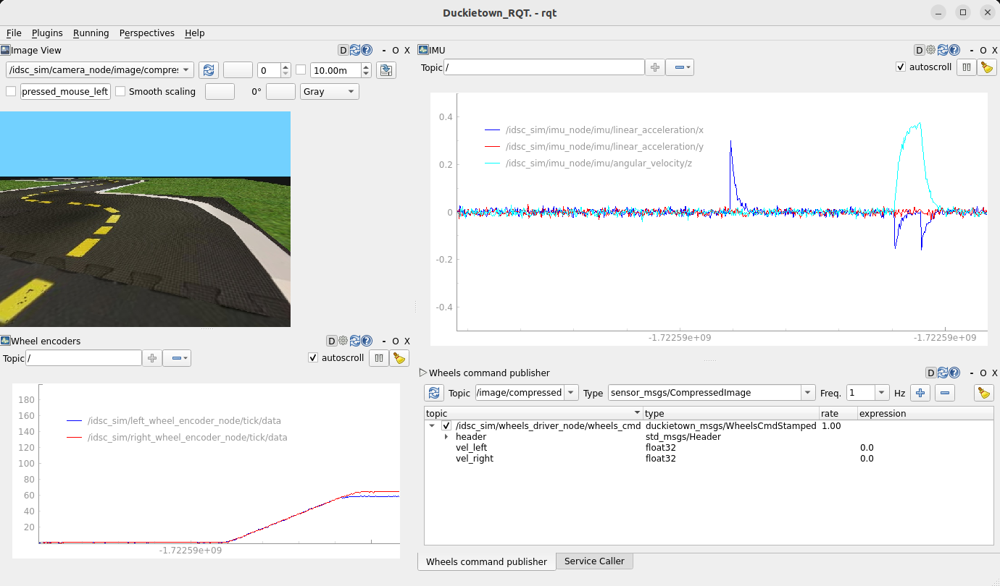
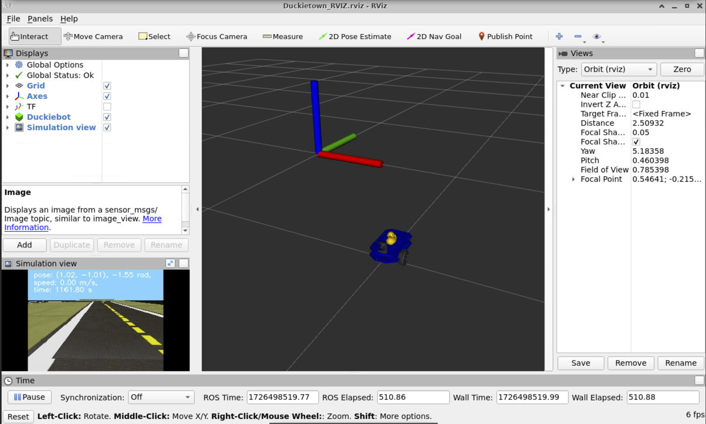

# Docker environment for Duckietown class

This repository contains the necessary files to run a Docker container on a Duckiebot that provides a complete desktop environment with ROS Noetic and other tools for the Duckietown class.

* [1) Desktop environment on the Duckiebot](#1-desktop-environment-on-the-duckiebot)
	* [ 1.1) Access the desktop environment](#11-access-the-desktop-environment)
		* [VNC Client (E.g. Remmina, RealVNC viewer)](#vnc-client-eg-remmina-realvnc-viewer)
		* [Browser](#browser)
* [2) Different ways to connect and develop on your Duckiebot](#2-different-ways-to-connect-and-develop-on-your-duckiebot)
	* [ 2.1) VNC-like (complete desktop environment: recommended to visualize GUIs)](#21-vnc-like-complete-desktop-environment-recommended-to-visualize-guis)
	* [ 2.2) VS Code SSH (code editor environment + terminal environment: recommended to develop the code)](#22-vs-code-ssh-code-editor-environment--terminal-environment-recommended-to-develop-the-code)
		* [VS Code SSH without password](#vs-code-ssh-without-password)
	* [ 2.3) Native SSH (terminal environment)](#23-native-ssh-terminal-environment)
	* [ 2.4) Connecting tty directly with HDMI, keyboard, and mouse to Duckiebot (terminal environment)](#24-connecting-tty-directly-with-hdmi-keyboard-and-mouse-to-duckiebot-terminal-environment)
* [3) Clone the `vnc-docker` and the `simulation` repositories](#3-clone-the-vnc-docker-and-the-simulation-repositories)
* [4) Docker image and container](#4-docker-image-and-container)
	* [ 4.1) Pull/Build the docker image](#41-pullbuild-the-docker-image)
	* [ 4.2) Run the docker container](#42-run-the-docker-container)
	* [ 4.3) Access the running docker container](#43-access-the-running-docker-container)
	* [ 4.4) Updates](#44-updates)
	* [ 4.5) Other commands](#45-other-commands)
* [5) Tools inside the `main-workspace` container](#5-tools-inside-the-main-workspace-container)
	* [ 5.1) Simulator](#51-simulator)
		* [Updates](#updates)
	* [ 5.2) RQT](#52-rqt)
	* [ 5.3) RViz](#53-rviz)
	* [ 5.4) Code Editor](#54-code-editor)
* [6) Troubleshooting](#6-troubleshooting)

##  1) Desktop environment on the Duckiebot
**Click here if you cannot visualize the video below: [assets/media/vnc-usage.mp4](../assets/media/vnc-usage.mp4)**.


The docker container used for this class provides, together with ROS Noetic and other utils, a complete desktop environment to being able to develop the project/exercises directly on the Duckiebot, allowing to display graphical interfaces (GUIs) like file manager, RQT, RViz, OpenCV windows, or code/text editors. 

### 1.1) Access the desktop environment
You can access from you laptop the desktop environment running on the Duckiebot using a VNC client or a browser. 

***IMPORTANT***: **you need to be connected to the same network as the Duckiebot, using the same WiFi network or an Ethernet cable**. Read [next section](#important-you-need-to-be-connected-to-the-same-network-as-the-duckiebot-using-the-same-wifi-network-or-an-ethernet-cable).

####  VNC Client (E.g. Remmina, RealVNC viewer)
Use a vnc client (Ubuntu comes by default with Remmina), connect to `<DUCKIEBOT_NAME>.local:5900` (with RealVNC viewer, just `<DUCKIEBOT_NAME>.local` is enough)

**Click here if you cannot visualize the video below: [assets/media/realvnc-connect.mp4](../assets/media/realvnc-connect.mp4)**.


####  Browser
Open a browser and connect to `http://<DUCKIEBOT_NAME>.local:6080/vnc.html`. Note that with this method you will not be able to copy-paste text from outside to inside the NoVNC browser page.

**Click here if you cannot visualize the video below: [assets/media/novnc-connect.mp4](../assets/media/novnc-connect.mp4)**.


##  2) Different ways to connect and develop on your Duckiebot

#### ***IMPORTANT***: **you need to be connected to the same network as the Duckiebot, using the same WiFi network or an Ethernet cable**.
To add new networks to the Duckiebot, follow the instructions in the [Duckietown Manual](https://docs.duckietown.com/daffy/opmanual-duckiebot/debugging_and_troubleshooting/network_config/index.html#add-wi-fi-networks-without-reinitializing-the-sd-card). A first WiFi network is already configured on the Duckiebot for the *autolab5* network (password: quackquack) of the shared Duckietown space in room ML K31, but you can add more WiFi networks. Otherwise, you can connect to the Duckiebot with an Ethernet cable.

---

You can connect to your Duckiebot in different ways: [VNC-like](#21-vnc-like-complete-desktop-environment-recommended-to-visualize-guis), [VS Code SSH](#22-vs-code-ssh-code-editor-environment--terminal-environment-recommended-to-develop-the-code), [Native SSH](#23-native-ssh-terminal-environment), or [tty](#24-connecting-tty-directly-with-hdmi-keyboard-and-mouse-to-duckiebot-terminal-environment). Note that anyway you should also connect through the VNC-like connection to be able to visualize the graphical interfaces.

###  2.1) VNC-like (complete desktop environment: recommended to visualize GUIs) 
As explained in [1) Desktop environment on the Duckiebot](#1-desktop-environment-on-the-duckiebot), you can connect to the desktop environment running on the Duckiebot using a VNC client or a browser. Apart from using the desktop environment as a display to visualize graphical interfaces, you can also develop the project/exercises directly inside it (e.g. using the code editor, the terminal, the file manager, etc.). However, the recommended way to develop the project/exercises is to use [VS Code SSH](#22-vs-code-ssh-code-editor-environment--terminal-environment-recommended-to-develop-the-code).

###  2.2) VS Code SSH (code editor environment + terminal environment: recommended to develop the code)
On your laptop, install VS Code and its extension [Remote Development extension](https://marketplace.visualstudio.com/items?itemName=ms-vscode-remote.vscode-remote-extensionpack).

Then, press `Ctrl+Shift+P` and search for `>Remote SSH: Connect to Host...` (or click on the blue square icon `><` on the bottom-left corner of VS Code, then click from the pop-up list `Connect to Host`) and choose `<DUCKIEBOT_NAME>.local` (if required the password is `quackquack`). When the new VS Code window opens you are ready to go: VS Code is now connected to the Duckiebot and is displaying the files and folders on the Duckiebot.

**Click here if you cannot visualize the video below: [assets/media/vscode-ssh.mp4](../assets/media/vscode-ssh.mp4)**.


##### VS Code SSH without password
If you don't have already an SSH key on your laptop, run `ssh-keygen` to generate one.
Then run on your laptop (only once, the first time you connect to the Duckiebot):
```
ssh-copy-id duckie@<DUCKIEBOT_NAME>.local
```
You can now connect using the VS Code SSH extension without password.

###  2.3) Native SSH (terminal environment)
On your laptop:
```
ssh duckie@<DUCKIEBOT_NAME>.local
```
password: `quackqauck`.

Your laptop terminal is now connected to the Duckiebot, as if you were using the terminal directly on the Duckiebot.

##### Native SSH without password
If you don't have already an SSH key on your laptop, run `ssh-keygen` to generate one.
Then run on your laptop (only once, the first time you connect to the Duckiebot):
```
ssh-copy-id duckie@<DUCKIEBOT_NAME>.local
```
You can now connect using the VS Code SSH extension without password.

###  2.4) Connecting tty directly with HDMI, keyboard, and mouse to Duckiebot (terminal environment):
Attach monitor with the HDMI cable, keyboard, and mouse to the free available ports on the Duckiebot. When you see the login request on the monitor, use the following credentials:
login: `duckie`, password: `quackquack`


## 3) Clone the `vnc-docker` and the `simulation` repositories

**The following steps assumes you have succesfully connected to the Duckiebot**.

**You first need to setup your GitHub account on the Duckiebot, and being a member of the GitHub [`ETHZ-DT-Class`](https://github.com/ETHZ-DT-Class) organization**.

Clone the `vnc-docker` repository within [`/home/duckie/`](../../../../home/duckie/):
```
git clone git@github.com:ETHZ-DT-Class/vnc-docker.git /home/duckie/vnc-docker
```

Then, you clone the `simulation` repository within [`vnc-docker/user_coude_mount_dir/`](../user_code_mount_dir/):
```
git clone git@github.com:ETHZ-DT-Class/simulator.git /home/duckie/vnc-docker/user_code_mount_dir/simulator
```


##  4) Docker image and container

**The following steps assumes you have succesfully connected to the Duckiebot and cloned the required `vnc-docker` repository**.

**The mentioned `make ...` commands must be run inside the `vnc-docker` repository folder (at the same level of the [`Makefile`](../Makefile) file). Check the [`Makefile`](../Makefile) if you are interested about the actual terminal commands being run behind the scenes. To display a help message about the available make commands, run `make help`**

###  4.1) Pull/Build the docker image

**When you received your Duckiebot, we already pulled the `dt-ros-noetic-vnc` docker image v1.0.0 for you. You don't have to pull it again (or build it), unless an update is released (see [4.4) Updates](#44-updates))**

You can pull the docker image `dt-ros-noetic-vnc` that will be used for the class from the Docker Hub or build it yourself. To pull the docker image from Docker Hub, run `make pull`. To build the docker image yourself, run `make build`.

### 4.2) Run the docker container

**When you received your Duckiebot, we already run the `main-workspace` container for you, using the `dt-ros-noetic-vnc` docker image v1.0.0. You don't have to run it again, unless an update is released (see [4.4) Updates](#44-updates))**

Run `make run` to run the container with the name `main-workspace` (you need to run it only once, after the first time you build/rebuild or pull/repull the docker image, since the container will activate automatically every time you turn on the Duckiebot).

###  4.3) Access the running docker container
To access the *running* docker container `main-workspace`:
- if you are connected to the Duckiebot using VNC-like: the desktop environment you see is already inside the running container, you don't have to do anything.
- if you are connected to the Duckiebot using VS Code SSH: you have two options:
	- suggested: press `Ctrl+Shift+P` and search for `>Dev Containers: Attach to Running Container...` (or click on the same bottom-left blue icon used previously to *Connect to Host* (which now should contain `SSH: <DUCKIEBOT_NAME>.local`) and click from the pop-up list `Attach to Running Container`). Choose the container `main-worksapce`, and when the new VS Code window opens you are ready to go.
	**Click here if you cannot visualize the video below: [assets/media/vscode-ssh-docker.mp4](../assets/media/vscode-ssh-docker.mp4)**.

	

	- alternative: run `make exec`, which is equivalent to `docker exec -it main-workspace bash`, and you are ready to go.
- if you are connected to the Duckiebot using SSH/tty terminal: run `make exec`, which is equivalent to `docker exec -it main-workspace bash`, and you are ready to go.
  
If you encounter problems accessing (attaching) the container, check that the container is running with `make check-running`.

***IMPORTANT*** The project/exercises are run inside the docker container. However, the actual project/exercise repositories will be stored outside the docker container, in the directory [`user_code_mount_dir/`](../user_code_mount_dir). This directory is mounted inside the docker container at `/code/catkin_ws/src/user_code/`. This means that whatever changes you make within [`user_code_mount_dir/`](../user_code_mount_dir) outside the docker container, it will be instantly reflected within the folder `/code/catkin_ws/src/user_code/` inside the docker container, and vice-versa.

###  4.4) Updates
During the class, the docker image `dt-ros-noetic-vnc` could be updated with new features or bug fixes. If this is the case, we will ask you to update the image and to work with the new image only. To do so, you have two options:
- run `make pull` to download the already built updated image from Docker HUB;
- update this `vnc-docker` repository with `git pull`, then run `make build` to build the updated image yourself.

***IMPORTANT***: when you pull or build a new version of the docker image, you need to **stop** and **remove** the current running container (which is using the old image) with `make stop` and `make rm-container`, then run a new container (which will use the new image) with `make run`. If in doubt, run `make rerun` which will stop and remove the current container and run a new container.

We will update on Moodle the version number of the docker image you should use, to help you confirm that you have correctly update the image. When you run a new container with the updated image, check in the terminal where you have run the container the *IMAGE_VERSION* from the printed *Makefile params* information. You can also check the version by running `make show-versioning` or `make show-params` *outside* the container at any time, or `echo $DT_IMAGE_VERSION` *inside* the container.

***IMPORTANT*** The docker image has a version with the format *X.Y.Z* ([semantic versioning](https://semver.org/)). For this class, the version will only change in its X and Y values, with the following meaning:
- increase in X value (major update): we updated the docker image in some way, you **must** update the image (run `make pull` or `git pull`+`make build`). 
- increase in Y value (minor upddate): we updated the instructions/documentation only (comments in code, or READMEs, ...), you don't have to update the docker image, but is recommended that at least you update the repository to update the instructions/documentation (run `git pull` only).

### 4.5) Other commands
To display a help message about the available commands, run `make help`.

Apart from the already mentioned make commands, other useful commands to manage the building/running workflow:
- `make exec` to access the running container with a bash shell;
- `make stop` to stop the running container;
- `make rm-container` to remove the container;
- `make rerun` to stop and remove the current container, and run a new container;
- `make rerun-with-pull` to stop and remove the current container, pull a new image, and run a new container;
- `make rerun-with-build` to stop and remove the current container, build a new image, and run a new container;

##  5) Tools inside the `main-workspace` container
###  5.1) Simulator
A custom simulation environment for this class is present at [user_code_mount_dir/simulator/](../user_code_mount_dir/simulator/) (you need to clone it, see [3) Clone the `vnc-docker` and the `simulation` repositories](#3-clone-the-vnc-docker-and-the-simulation-repositories)). Since the [user_code_mount_dir/](../user_code_mount_dir/) is mounted on the container, the simulator is available to be run inside it. The simulator is a standard ROS package. Run the simulator node with the default config parameters with `roslaunch simulator simulator.launch`. You can visualize the simulation (with the simulated sensor data) with RQT, or partially with Rviz. 

**While developing the exercises, if you are required to work with the simulator you will find in the exercise's README the instructions on how to run the simulator with the correct config parameters for that specific exercise**. For extra, more detailed and "low-level" information, check the [Simulation_README.md](./Simulation_README.md) (but you **don't** need to read it for the development of the exercises).

#### Updates

During the class, the simulator could be updated with new features or bug fixes. If this is the case, we will ask you to update the git repository of the simulator and to work with the new version of the simulator only. To do so, you have to `git pull` while being inside the simulator folder. Then you may run `catkin build` inside the docker container to build the updated exercise package.

You ***DO NOT*** need to stop and remove the current running container when updating the simulator repository, or to pull/build a new version of the docker image. You can continue to work with the same running container. You just have to update the git repository of the simulator.

We will update on Moodle the versioning number of the simulator you should use, to help you confirm that you have correctly update it. To check this, simply run `make show-versioning` *outside* the container, or manually check the *version* tag inside the [`package.xml`](../user_code_mount_dir/simulator/package.xml) file of the simulator repository.

### 5.2) RQT
RQT is a ROS tool that provides a GUI plugin interface for ROS. You can use RQT to visualize and interact with ROS nodes, topics, services, and parameters through a modular and customizable interface. It helps in monitoring and debugging ROS systems by offering a range of built-in plugins.

RQT is already installed in the `main-workspace` container. You can run it with `rqt` in the terminal. An empty window will open: 
- click on the `Plugins` menu to add the plugins you need (e.g. `Visualization/Image View`, `Visualization/Plot`) and create your custom RQT configuration.
- or click on the `Perspectives` menu to save your RQT configuration (called *perspective*) or load a custom RQT configuration saved previously. You can also directly run RQT loading a specific perspective file with `rqt --perspective-file <PERSPECTIVE_PATH>`. We created an initial perspective file that you can load, located at `/code/catkin_ws/src/Duckietown_RQT.perspective`. <p align="left">
  &nbsp; &nbsp;
  
</p>

For more information about RQT, check the [official RQT wiki](https://wiki.ros.org/rqt).

### 5.3) RViz
RViz is a ROS tool that provided a 3D visualization interface for ROS. You can use RViz to visualize and interact with some sensor data and robotic state information in real-time.

RViz is already installed in the `main-workspace` container. You can run it with `rviz` in the terminal. A window will open:
- click on `Add` to add the displays you need (e.g. `Path`, `Image`) and create your custom RViz configuration.
- or click on the `File` menu to save your RViz configuration or load a custom RViz configuration saved previously. You can also directly run RViz loading a specific configuration file with `rviz -d <CONFIG_PATH>`. We created an initial configuration file that you can load, located at `/code/catkin_ws/src/Duckietown_RViz.rviz`. <p align="left">
  &nbsp; &nbsp;
  
</p>

For more information about RViz, check the [official RViz wiki](https://wiki.ros.org/rviz).

### 5.4) Code Editor

The recommended workflow is to use the VS Code SSH extension to connect to the Duckiebot, to use VS Code as the code editor to develop the project/exercises. This is explained in [2.2) VS Code SSH](#22-vs-code-ssh-code-editor-environment--terminal-environment-recommended-to-develop-the-code) and [4.3) Access the running docker container](#43-access-the-running-docker-container).

However, inside the container you can find the lightweight code editor *SublimeText*, together with the text editors *gedit*, *mousepad*, *nano*, *vi*, and *vim*.


##  6) Troubleshooting

If you encounter a `permission denied` / `insufficient permissions` / `file is unwritable` error, run `make chown` to change the ownership of all the files and folders inside this `vnc-docker` repository.

See [TROUBLESHOOTING.md](./TROUBLESHOOTING.md) for common problems and solutions you may encounter when developing the project/exercises or common problems and solutions for the `dt-ros-noetic-vnc` docker image/`main-workspace` container. If you encounter other issues, before writing on Moodle first check the *Duckiebot FAQ Guide* and *Troubleshooting guides* in the [Duckietown Manual](https://docs.duckietown.com/daffy/opmanual-duckiebot/intro.html).
